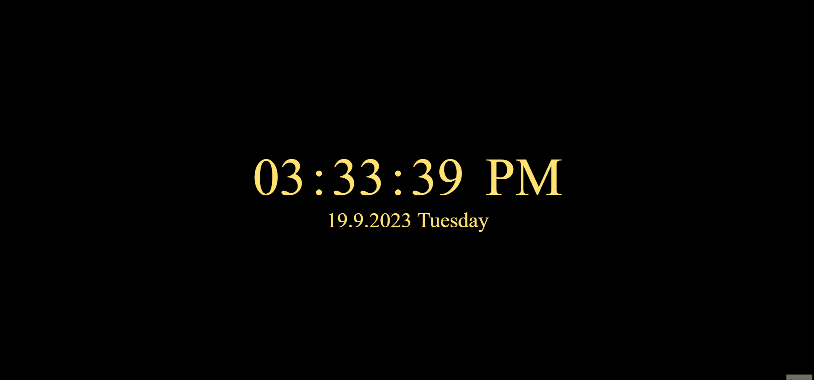

[👉 click here to view the page](https://msaiduslu.github.io/Digital-Clock-JS/)

# Project-005 : Digital Clock

## Description

Project aims to create a digital clock.

## Project Skeleton

```
Digital-Clock(folder)
|
|----readme.md
|----index.html
|----style.css
|----app.js
```

## Objective

Build a Digital Clock web site

### At the end of the project, i will be able to;

- improve coding skills within HTML & CSS & JS

- use git commands (push, pull, commit, add etc.) and Github as Version Control System.
